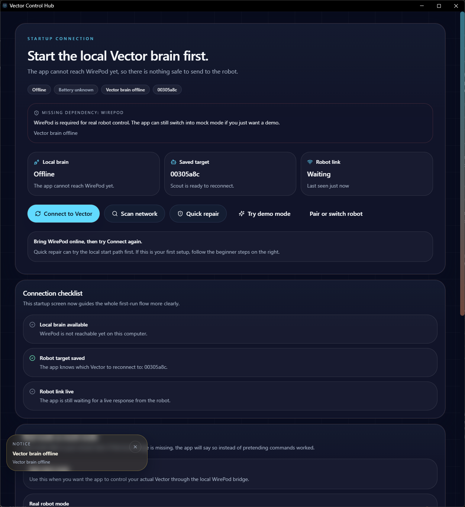
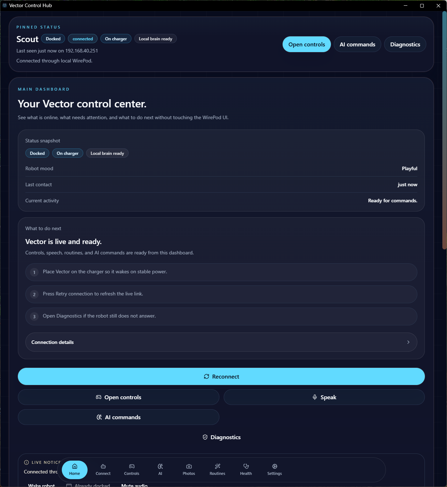
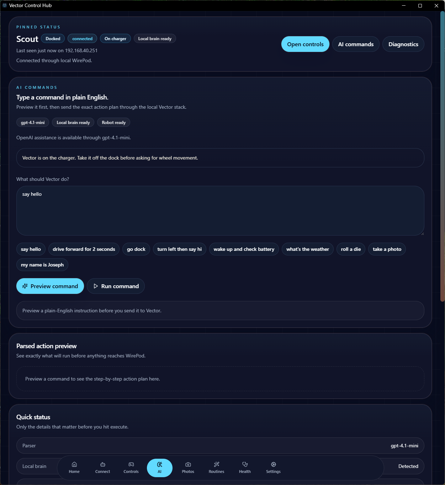
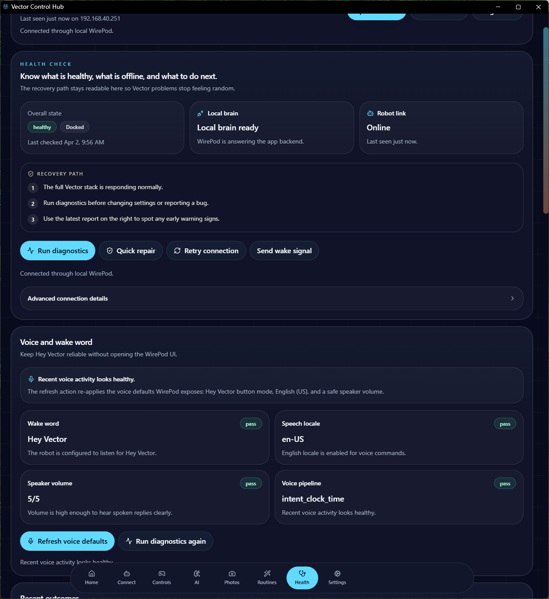

# Vector Control Hub


Vector Control Hub is a local-first dashboard for the Anki / DDL Vector robot.

One app for connection, drive controls, speech, diagnostics, routines, AI command previews, and camera tools — with WirePod as the local bridge.

## At A Glance

- Built for normal users, not just script-heavy setups
- Keeps robot control local on your machine
- Provider-based engine architecture (WirePod, Mock, Embedded*)
- Includes Mock Mode so the app still works without a robot
- Runs as a Windows-first local app with a one-click starter
- Pro tier via local licensing — no internet or Stripe required for activation

> \* Embedded (direct SDK) transport is not yet implemented. The option is present but disabled in the UI.

## Get Started with Docker

The fastest way to run Vector Control Hub on Windows is with Docker Desktop (the only required install):

```powershell
# From the repository root:
docker compose up -d --build
```

Then open **http://localhost:4173** in your browser.

No Node.js, WirePod local install, or other prerequisites required.

> **Mock Mode** – try the full UI without a robot:
> ```powershell
> .\scripts\install-windows.ps1 -MockMode
> ```

Full instructions, troubleshooting, and configuration options are in [README.quickstart-docker.md](./README.quickstart-docker.md).

## How It Works

```
User
  └─► Vector Control Hub (React frontend)
        └─► Express backend (Node.js)
              └─► Engine provider (wirepod | mock | embedded*)
                    └─► Vector robot
```

The backend owns all robot communication behind a provider abstraction. The frontend never talks directly to WirePod or the robot.

**API routes:**

| Prefix | Purpose |
|---|---|
| `/api/engine/*` | Engine provider management (status, switch, settings) |
| `/api/robot/*` | Robot control (drive, speak, camera, diagnostics) |
| `/api/license/*` | Local license activation and tier status |

**Engine providers:**

| Provider | Status | Notes |
|---|---|---|
| `wirepod` | ✅ Default | Recommended. Requires a running WirePod server. |
| `mock` | ✅ Available | No robot needed. Good for demos and UI testing. |
| `embedded` | 🚧 Coming soon | Direct SDK transport — not yet implemented. |

For full architecture details see [docs/ARCHITECTURE.md](./docs/ARCHITECTURE.md).

## Onboarding Wizard

First-time users are walked through a four-step setup wizard:

1. **Welcome** — feature overview
2. **Choose engine** — pick WirePod (recommended), Mock, or Embedded (disabled)
3. **Connection test** — verify the engine is reachable (non-blocking)
4. **Complete** — go to the dashboard

The wizard stores its completion flag in `localStorage`. To re-run it: `localStorage.removeItem("vector_onboarding_complete")`.

See [docs/ONBOARDING_FLOW.md](./docs/ONBOARDING_FLOW.md) for the full flow.

## Pro Tier

A Pro license unlocks advanced automation, premium personality packs, advanced repair tools, priority support, and removes ads.

Activation is **fully offline** — no Stripe, no internet call:

```bash
POST /api/license/activate   { "key": "PRO-XXXX-XXXX" }
```

A key starting with `PRO-` activates the pro tier and is stored locally in `vector-license.local.json`.

## Main Features

- Auto-detects local WirePod endpoints
- Drive, wake, dock, volume, head, and lift controls
- AI command preview and execution
- Diagnostics and log viewer
- Repair tools and bridge watchdog
- Local routine storage
- Camera/photo capture and sync
- Mock mode for testing when the robot stack is unavailable

## Screenshots

| Startup connection | Main dashboard |
| --- | --- |
|  |  |

| AI commands | Diagnostics |
| --- | --- |
|  |  |

## Tech Stack

| Layer | Technology |
|---|---|
| Frontend | React 18, TypeScript, Vite, Tailwind CSS, Zustand |
| Backend | Node.js, Express, TypeScript, Zod |
| Local bridge | WirePod (via HTTP) |
| Desktop | Electron (Windows) |
| Mobile | Capacitor (Android, `app/android`) |
| Container | Docker Compose |

## Project Status

Phase 1 (stable Windows release) and Phase 2 (mobile companion) are complete.

- WirePod is still required for real robot control
- The backend has a provider-agnostic engine layer — WirePod lives behind that boundary
- Active development is focused on true one-app independence (Phase 3)

Phase roadmap: [docs/PHASES.md](./docs/PHASES.md)

## Mobile Direction

The Android shell foundation lives in `app/android` (Capacitor).

Intended first mobile path: `Phone UI → LAN backend → local WirePod → Vector`

See [docs/MOBILE_ANDROID.md](./docs/MOBILE_ANDROID.md) for setup steps.

## Quick Start

### Easiest launch (Windows)

Double-click `start-app.bat` — it installs dependencies, builds if needed, and opens the app.

After code changes: `refresh-app.bat`

### Manual install

```bash
npm install
npm start
```

### Frontend only / Backend only

```bash
npm run dev:app
npm run dev:server
```

### Build

```bash
npm run build
npm run typecheck
npm run lint
npm run test
```

### Windows installer

```bash
npm run release:windows
# Output: dist-electron/
```

### Android shell

```bash
npm run mobile:android:doctor
npm run mobile:android:prepare
npm run mobile:android:open
```

## First-Time Connection Flow

1. Start WirePod locally
2. Launch Vector Control Hub — the onboarding wizard opens
3. Select WirePod as your engine
4. Complete the connection test
5. Use the dashboard for daily robot control

## Demo / Mock Mode

Run the full UI without a robot. Useful for UI testing, screenshots, and demos.

Switch to Mock in the onboarding wizard or in **Settings → Engine**.

## Environment Setup

### Backend

```text
server/.env.local.example → server/.env.local
```

Key variables:

- `OPENAI_API_KEY` — optional, for AI command features
- `WIREPOD_BASE_URL` — default `http://127.0.0.1:8080`
- `WIREPOD_TIMEOUT_MS` — default `4000`

`server/.env.local` must never be committed.

## Privacy

Local-first by default. See [PRIVACY.md](./PRIVACY.md).

What may leave the machine:
- OpenAI API calls (only if you add your own key)
- AdSense (only on the public hosted PWA, with your own publisher ID)

## Project Structure

```text
app/                React frontend
server/             Express backend
docs/               Documentation
scripts/            Local helper scripts
start-app.bat       Windows launcher
docker-compose.yml
```

## Documentation

| File | Contents |
|---|---|
| [docs/ARCHITECTURE.md](./docs/ARCHITECTURE.md) | System design, engine providers, API routes, data storage |
| [docs/ONBOARDING_FLOW.md](./docs/ONBOARDING_FLOW.md) | Onboarding wizard step-by-step |
| [docs/REPAIR_TOOLS.md](./docs/REPAIR_TOOLS.md) | Quick repair, bridge watchdog, diagnostic reports |
| [docs/RELEASE_CHECKLIST.md](./docs/RELEASE_CHECKLIST.md) | Release process checklist |
| [docs/RELEASING.md](./docs/RELEASING.md) | Full release steps |
| [docs/PHASES.md](./docs/PHASES.md) | Phase roadmap |
| [docs/MOBILE_ANDROID.md](./docs/MOBILE_ANDROID.md) | Android shell setup |

## Troubleshooting

**"Vector brain offline"** — check that WirePod is running, the robot is on the same network, and Mock Mode is off.

**AI page unavailable** — `OPENAI_API_KEY` is missing or invalid. Local rule-based commands still work.

**Robot reacts but won't drive** — check that Vector is off the charger.

**Camera page empty** — ask Vector to take a photo first, then use `Retrieve latest photo`.

## FAQ

**Do I need WirePod?** Yes, for real robot control today.

**Does this replace WirePod?** No. It sits on top of WirePod and is meant to become the everyday UI.

**Does it send data to the cloud?** Not by default. Robot control is local. OpenAI features require your own key.

**Is Mock Mode required?** No. Use it only when you want a demo or fallback path.

## Known Limitations

- Embedded (direct SDK) transport is not yet implemented
- Real robot control still requires WirePod
- Live battery updates use polling, not a push stream
- Some classic community commands use safe partial fallbacks
- Windows is the primary platform; mobile is a companion path
